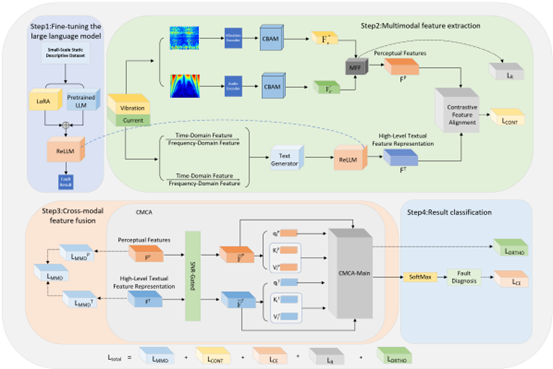

# SAE-CAM code

---

**This is the source code for "Multimodal Bearing Fault Diagnosis Based on Semantic-Aware and Enhanced Cross-Attention". You can refer to the following steps to reproduce the fault diagnosis task.**
<p align="center">
  
</p>

# :triangular_flag_on_post:Highlights

----

**A multimodal fault diagnosis method based on semantic perception and enhanced cross-attention is proposed. Physical features are mapped into semantic inputs understandable by large models, enabling a shift from “feature engineering-driven” to “semantic understanding-driven” diagnosis, achieving stronger noise robustness and higher efficiency.**

**By mapping multimodal signals into a unified semantic space, large language models are leveraged for semantic feature extraction. A cross-modal temporal and event alignment mechanism is introduced to enhance temporal awareness and discriminability of fused features, thereby improving fault classification accuracy.** 

**A signal-to-noise ratio-based attention gating mechanism is introduced to suppress noise, combined with bidirectional cross-attention for deep multimodal fusion. Shared and private features are distinguished and balanced, yielding more robust and discriminative representations that enhance model adaptability.**


# ⚙️Abstract

----
<p align="justify">
<b>&emsp;&emsp;Single-source domain generalization for fault diagnosis aims to train on a single-condition source domain and generalize to multiple unknown target domains, drawing widespread attention. Existing methods typically generate new domain features to expand data distribution and extract domain-invariant representations, but still face key challenges: (1) It is difficult for the model to extract robust features under noisy conditions, and feature perturbation may amplify the noise components, resulting in unreliable representation results; (2) Domain expansion often relies on random perturbations without proper constraints, leading to semantic distortion of the generated features; and (3) domain invariant feature learning overemphasizes semantic alignment while overlooking instance-level learning, failing to capture fine-grained inter-instance differences. To cope with these challenges, we propose a cross-contrast perturbation single-domain generalization architecture based on discrete wavelet convolutional networks. First, learnable discrete wavelet operators are employed to extract noise-robust features. Then, cross-contrast perturbation between the main and auxiliary networks enhances feature diversity while preserving semantic consistency, thereby improving the reliability of domain extension. Instance similarity learning is further introduced to ensure consistent feature space characterization and enhance model generalization. Finally, extensive experiments were conducted on gearbox and bearing datasets to validate the effectiveness of the proposed method.</b>
</p>

# :blue_book:Data preparation
---
```
python==3.6.13
scipy==1.5.3
tqdm==4.63.0
yacs==0.1.8
pyyaml==6.0.1
requests==2.27.1
protobuf==3.19.6
torch==1.10.2+cu113
opencv==4.5.3
pillow==6.2.2
matplotlib==3.3.4
scikit-learn==0.24.2
torchvision==0.11.3+cu113
torchaudio==0.10.2+cu113
torch-geometric==2.0.3
numpy==1.19.5
pandas==1.1.5

```
# Train
---
The paper is under review and now needs to be kept confidential.
# Evaluation
---
The paper is under review and now needs to be kept confidential.
# Acknowledgment
---
The paper is under review and now needs to be kept confidential.
# Citation
---
The paper is under review and now needs to be kept confidential.
